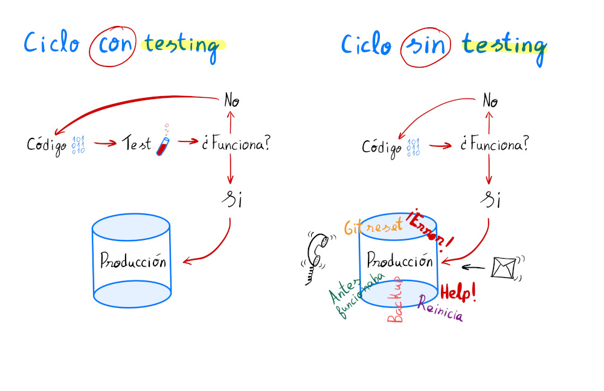

### Introduction to testing

Talking about testing we want to refer the empirical verification in order to improve the quality of our code. 
The complex of techniques which helps to assess the Fault Tolerance. 
There are a lot of options, Frameworks and guides nowadays. 
The most important among them that we might find:

#### Philosophies/Methodologies
> Test-Driven Development (TDD). 
> Behavior-Driven Development (BDD). 
> Domain-Driven Design (DDD). 

#### Testing that depends on the code visibility
> White-box testing. 
> Grey-box testing. 
> Black-box testing. 

#### Testing that depends on the application execution
> Static testing. 
> Dynamic testing. 

#### Functional testing that are performed on all test levels (what?)
> Component testing. 
> Integration testing. 
> System testing. 
> Acceptance/E2E testing. 

#### Non-functional testing (how well?)
> Performance testing. 
> Security testing. 
> Portability testing. 
> Reliability testing. 
> Usability testing. 

#### Testing that depends on the numbers of test or spent time
> Smoke testing. 
> Sanity checks. 
> Regression testing. 

If there is a small scope of work for testing, then it takes few time to spend for,  
but when the flow is increasing the productivity will be more linear and controlled. 
Before you say: "I'm not going to perform the testing because it's small", I want to remind you
the every project starts from small one.
Then, you could not find the resources because it will be too big to test or document (technical debts). 

#### What advantages does the testing have?
* Increase the quality of the project and code.
* Decrease the quantity of failures during new feature created.
* Less time to fix the issues.
* Increase the use of good practise.

#### Disadvantages?:
* Increase the time of the development.
* More complex.
* Many developers do not have such king of habits, 
  that is why at the beginning will be some rejection, and it will require some studying.
* It's difficult to test the old code. 

Obviously, the quality of our code will not be compromised.
When the client works with our application - he will not have technical problems.
Probably, he will not like the size of button or color of the text, 
but we will not get the list of issues.
That's why we'll sleep tightly.
