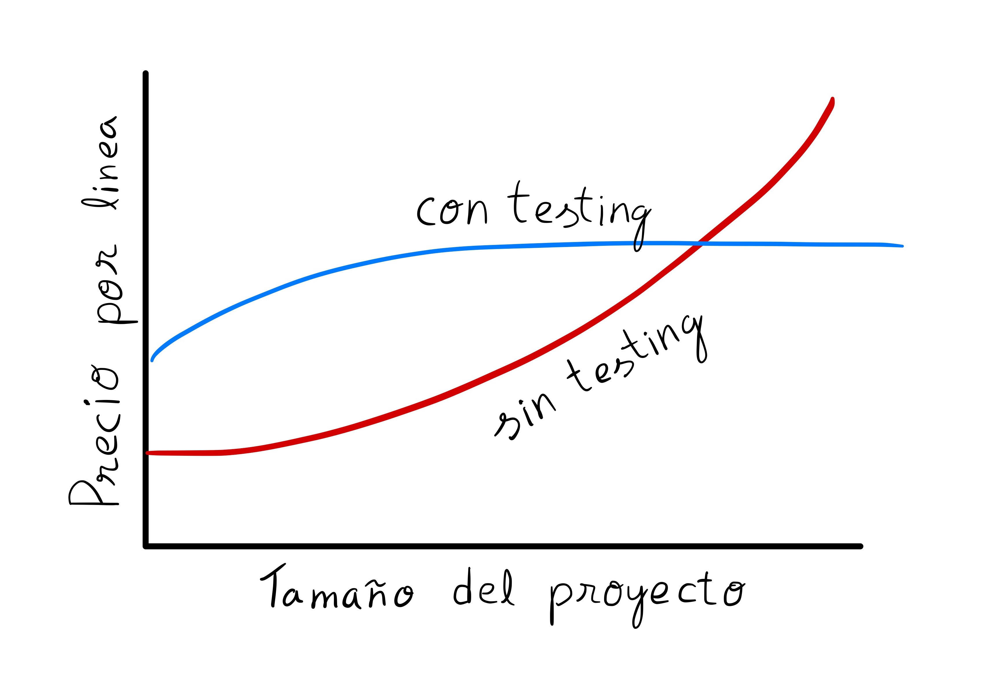

### Unit Testing (Component or Module)

The component tests or Unit testing is the methodology in order to check that the function works as expected.<br>
Trying to get the boundaries for quality assure as a result.<br>
In addition, it gives the confidence, feel of safety and peace of mind when new characteristics are added because
it notifies about code stops working.<br>

Though from the first glance it feels like we are waisting the time, 
but in fact the testing optimises the code and makes the project rentable.<br> 
How is it possible?<br>
The test development opens the opportunity to find the new issues - it will reduce the quantity of issues in a future
and there are fewer hours spent to resolve the problem consequently.
Nevertheless, the productivity of the project is low at the beginning.
We could observe this fact on the next graphic:



#### Tutorial with Python

Let's create the simple object for managing the smartphone battery.
It will be able to:
* Get the battery percentage.
* Modify the percentage.
* Generate the text with visually nice explanation: "My percentage is 32%".
* It will be called battery.py and will contain the next code inside (source_code/battery.py):

```python
class Battery:
    PERCENTAGE = 0

    def get_percentage(self) -> int:
        return self.PERCENTAGE

    def is_full(self) -> bool:
        return self.PERCENTAGE == 100

    def set_percentage(self, new_percentage):
        my_percentage = new_percentage
        if new_percentage > 100:
            my_percentage = 100
        if new_percentage < 0:
            my_percentage = 0
        self.PERCENTAGE = my_percentage

    def show_battery_percentage(self): 
        return f"My percentage is {self.get_percentage()}"
```

The file with tests for battery.py function is located in source_code/battery_tests.py:

```python
from unittest import TestCase, main
from battery import Battery
from random import randint

class BatteryTest(TestCase):
    def setUp(self):
        self.battery = Battery()

    def test_get_percentage(self):
        percentage = self.battery.get_percentage()
        self.assertTrue((0 <= percentage) and (percentage <= 100))

    def test_set_percentage(self):
        self.battery.set_percentage(-1)
        self.assertEqual(self.battery.get_percentage(), 0)

        self.battery.set_percentage(0)
        self.assertEqual(self.battery.get_percentage(), 0)

        self.battery.set_percentage(1)
        self.assertEqual(self.battery.get_percentage(), 1)

        self.battery.set_percentage(50)
        self.assertEqual(self.battery.get_percentage(), 50)

        self.battery.set_percentage(99)
        self.assertEqual(self.battery.get_percentage(), 99)

        self.battery.set_percentage(100)
        self.assertEqual(self.battery.get_percentage(), 100)

        self.battery.set_percentage(101)
        self.assertEqual(self.battery.get_percentage(), 100)

    def test_battery_is_full(self):
        self.battery.set_percentage(100)
        self.assertTrue(self.battery.is_full())

        self.battery.set_percentage(101)
        self.assertTrue(self.battery.is_full())

        self.battery.set_percentage(99)
        self.assertFalse(self.battery.is_full())

        self.battery.set_percentage(0)
        self.assertFalse(self.battery.is_full())

        self.battery.set_percentage(-100)
        self.assertFalse(self.battery.is_full())

    def test_text_percentage_message(self):
        self.battery.set_percentage(randint(0, 100))
        self.assertTrue(self.battery.show_battery_percentage(),
                        f"My percentage is {self.battery.get_percentage()}%")


if __name__ == "__main__":
    main()
```

As you've already noticed the _setUp_ is used before test run to create the instance of Battery class 
with the functions that are going to be tested, and after the test is finished - _tearDown_ function performed,
usually it contains the instructions for test preconditions, 
returning the environment to previous state like it was before the test run.<br>

When the tests complete, the report is generated:
```log
======================================= test session starts =================================
collected 4 items                                                                                                                                                 

battery_tests.py::BatteryTest::test_battery_is_full PASSED                                   [ 25%]
battery_tests.py::BatteryTest::test_get_percentage PASSED                                    [ 50%]
battery_tests.py::BatteryTest::test_set_percentage PASSED                                    [ 75%]
battery_tests.py::BatteryTest::test_text_percentage_message PASSED                           [100%]

========================================= 4 passed in 0.15s ==================================

```

#### Data Providers

In case we want to check the list of results just call isFull function:

```csv
Function Percentage Expectation
isFull()     0      False
isFull()     1      False
isFull()     35     False
isFull()     50     False
isFull()     99     False
isFull()     100    True
```
It's time to test all of them. Probably, you think that there are more important things exist, and you are right. 
Fortunately, you are not the only one person who thinks so, that's why the Data Providers is created.
The simple system where the array with values is passing, which are being tested one by one in a ring.
Look at the realisation:

```python
from unittest import TestCase, main
from battery import Battery
from unittest_data_provider import data_provider


class BatteryTest(TestCase):
    charge_items = lambda: (
        (0, False),
        (1, False),
        (35, False),
        (50, False),
        (99, False),
        (100, True),
    )
    
    def setUp(self) -> None:
        self.battery = Battery()

    @data_provider(charge_items)
    def test_is_full_charged(self, percentage, expected):
        self.battery.set_percentage(percentage)
        self.assertTrue(self.battery.is_full() == expected)


if __name__ == "__main__":
    main()
```

Run the test, and it returns the soothing result:

```log
================================== test session starts ==================================
collected 1 item                                                                                                                                                  

battery_data_provider.py::BatteryTest::test_is_full_charged PASSED                  [100%]

=================================== 1 passed in 0.16s ====================================
```

#### Data Base

Testing of our code is relatively easy because the code reacts itself.
What is happening when we have the DB?
Here we deal with a problem: 
to get to know that everything work as expected, we need to create, update and delete a lot of data.
What if something is going wrong? (with the big possibility)
_How could we explain our product owner, stakeholder/customer that all users were removed from DB after the testing?_

```markdown
⚠️Before continue you need to know that you never have to test the DB in production.
The reason is not important: time, code economy, simplifier...
This always finishes with disaster.
```

But it does not mean that you could not test with real data. You could use some solutions.

#### Duplicate DB
You will copy the DB before the testing.

```python
import sqlite3

def progress(status, remaining, total):
    print(f'Copied {total-remaining} of {total} pages...')

con = sqlite3.connect('existing_db.db')
bck = sqlite3.connect('backup.db')
with bck:
    con.backup(bck, pages=1, progress=progress)
bck.close()
con.close()
```

#### Load DB to the memory

To open DB connection you could use ":memory:", which creates a temporary database in RAM instead of resides on a disk.

```python
import sqlite3

con = sqlite3.connect(":memory:")
cur = con.cursor()
...
```

#### Load new data to replicated tables

```python
import sqlite3

con = sqlite3.connect(":memory:")
cur = con.cursor()
cur.execute("create table languages (name, first_appeared)")

# This is the qmark style:
cur.execute("insert into languages values (?, ?)", ("JavaScript", 1995))

# qmark style with executemany():
languages_list = [
    ("Fortran", 1956),
    ("Python", 1991),
    ("Julia", 2012),
]
cur.executemany("insert into languages values (?, ?)", languages_list)

# named style:
cur.execute("select * from languages where first_appeared=:year", {"year": 1991})
print(cur.fetchall())

con.close()
```