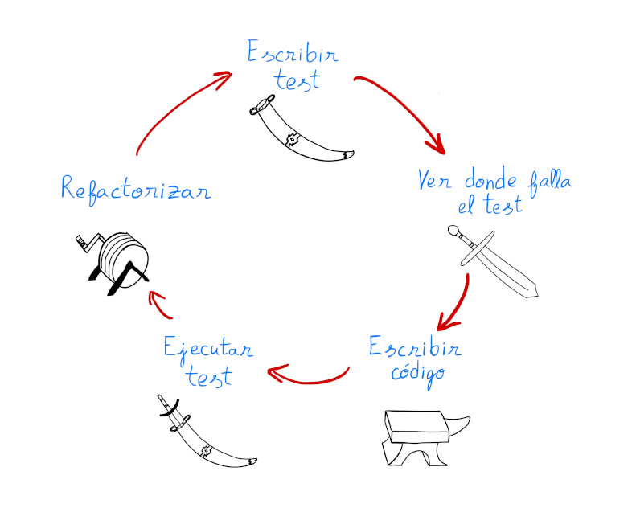
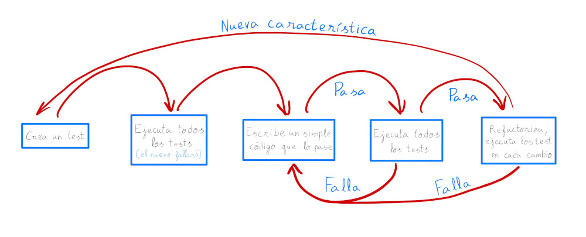

### TDD

Test-Driven Development is the most used practice of programming for developers.
Its main idea is in the design which is opposite the traditional testing, first add tests then - new code if it fails.
Probably, the reason of its being is not clear because of its abstractness.
Let's observe the cycle of developing the sword:
1. Create the sword case for the sword.
2. Forge the sword and introduce it.
3. Perform minimal numbers of hammering to get adequate form od sword.
4. Try to fit the sword in the sword case again. If it fails - perform hammering again.
5. Finally, the sword fits perfectly to the sword case. 
6. Perform refactoring: remove impurity and add shine.



#### The flow

Beyond the TDD is methodology o guide how to provide effective testing. It has the strict process, which 
directs to give the higher priority for testing then the coding where every step creates another test
till you are not be able to add more checks.



1. Create the test.
2. Execute all previous and new tests. First time will be failures.
3. Write the simple code which will pass.
4. Execute all the tests. If it fail - return to the previous step.
5. Refactoring execute the tests every changing: 
   * move the code where it should be;
   * remove repeated code;
   * create documentation;
   * divide the functions for less ones etc.
If it fails - return to the previous step.
6. Create the test for the next new characteristic, rerun the cycle.

#### Example

Let's write down the method with different states of water (solid, liquid or gaseous) depend on
the temperature which is given as a parameter.

##### 1. Initiate the function
Create the function with minimum code:

```python
class Water:
    def get_state(self, temperature):
        return ""

```

##### 2. Create the test

Create the file AguaTest with the test. 
In this case we are testing if it returns the Solid state between -273 C (minimum) and 0 C.

```python
from unittest import TestCase, main
from water import Water

class WaterTest(TestCase):
    def setUp(self) -> None:
        self.myWater = Water()

    def test_solid_state(self):
        for temperature in range(-273, 1):
            self.assertEqual("Solid", self.myWater.get_state(temperature),
                             f"The water state with {temperature} is not solid.")


if __name__ == "__main__":
    main()
```

##### 3. Execute the test

##### 4. Failure? Next step

##### 5. Refactoring or changing the code

Let's refactor the code to pass the test:

```python
class Water:
    def get_state(self, temperature):
        if temperature <= 0:
            return "Solid"

```

##### 6. Execute the test

It passed! Now let's add the next test. Liquid one?

```python
from unittest import TestCase, main
from water import Water

class WaterTest(TestCase):
...

    def test_liquid_state(self):
        for temperature in range(1, 100):
            self.assertEqual("Liquid", self.myWater.get_state(temperature),
                             f"The water state with {temperature} is not liquid.")
...

```

Execute the test... And it fails because it's logical. Let's refactor the code again:

```python
class Water:
    def get_state(self, temperature):
        if temperature <= 0:
            return "Solid"
        if 0 < temperature < 100:
            return "Liquid"
```

It passed! The next test... the circle is turning around till having all done.

##### Couldn't create more tests? The next step

My tests are completed:

```python
from unittest import TestCase, main
from water import Water

class WaterTest(TestCase):
    def setUp(self) -> None:
        self.myWater = Water()

    def test_solid_state(self):
        for temperature in range(-273, 1):
            self.assertEqual("Solid", self.myWater.get_state(temperature),
                             f"The water state with {temperature} is not solid.")

    def test_liquid_state(self):
        for temperature in range(1, 100):
            self.assertEqual("Liquid", self.myWater.get_state(temperature),
                             f"The water state with {temperature} is not liquid.")

    def test_gaseous_state(self):
        for temperature in range(100, 500):
            self.assertEqual("Gas", self.myWater.get_state(temperature),
                             f"The water state with {temperature} is not gaseous.")


if __name__ == "__main__":
    main()

```

##### 8. My final function

The class is completed and tested:

```python
class Water:
    def get_state(self, temperature):
        if temperature <= 0:
            return "Solid"
        if 0 < temperature < 100:
            return "Liquid"
        if 100 <= temperature < 500:
            return "Gas"
        return None

```

#### Tests with JavaScript

Similar to Python tests will be used some instrument. The most popular for JS ecosystem is Jest.
Let's install Jest:
```commandline
npm install jest
```

Let's create a JS file with the name operations.js. This is the code which we want to test.
It contains of 2 functions inside.

```jsregexp
function sum(number1, number2) {
    return number1 + number2;
}

function subtraction(number1, number2) {
    return number1 - number2;
}

// Export to call it from another modules/places
module.exports = {
    sum,
    subtraction
};

```

Now let's create the tests. We create the file with the name operaciones.test.js with the next content:

```jsregexp
const {sum, subtraction} = require('./operations');

test('2 + 3 expected to be 5', () => {
  expect(sum(2, 3)).toBe(5);
});

test('15 - 10 expected to 5', () => {
  expect(subtraction(15, 10)).toBe(5);
});

```

Modify the package.json, indicate how the test is expected to be executed:

```json
{
  "scripts": {
    "test": "jest"
  }
}
```

And let's run the test:

```commandline
npm run test
```

If any problem appears, it will be marked with red colour with the description what is expected and what is found.

The result:

```commandline
> test
> jest

 PASS  source_code/operation.test.js
  √ 2 + 3 expected to be 5 (2 ms)
  √ 15 - 10 expected to 5 (1 ms)

Test Suites: 1 passed, 1 total
Tests:       2 passed, 2 total
Snapshots:   0 total
Time:        0.589 s
Ran all test suites.
```