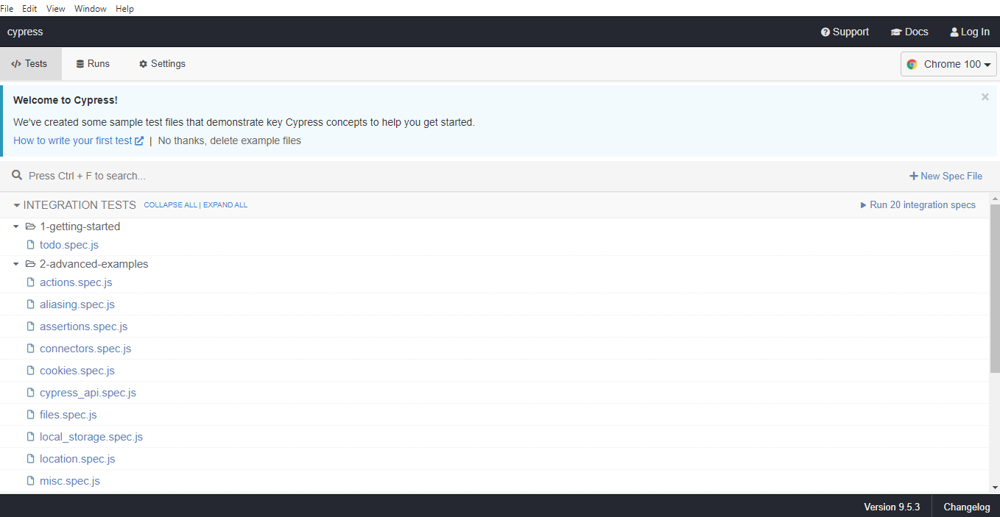
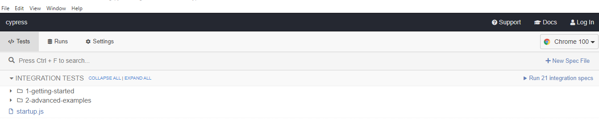
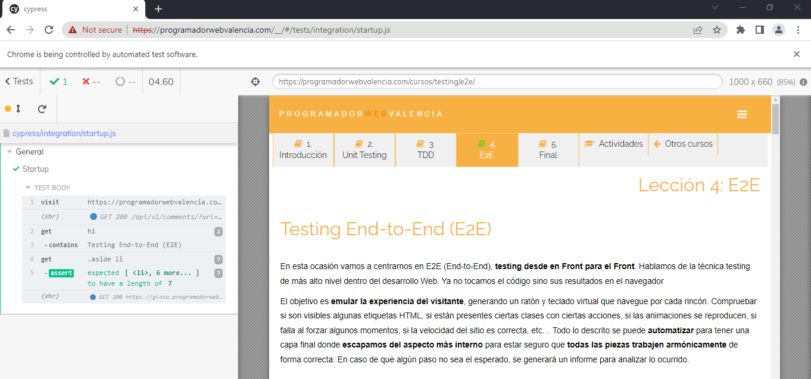

### End-to-End Testing (E2E)

This time let's concentrate on End-to_End testing - from the beginning to the end.
This technic of testing is the deepest level in web developing.
Here the code will not be touched, but the results of developing in a browser.<br>

The main idea is in malingering of user experience:
* check if HTML tags are visible;
* check if the particular classes are present with particular actions;
* check if any failures are reproduced when make different actions;
* check if the speed of the web-site is expected etc.

The all described steps could be automated to finalize the picture with the last layer, 
when the more internal aspects are hidden, in order to assure that all parts are consonant and work as expected.
In case when any step does not have expected result,
the ticket(bug) will be created to analyze and fix the occurred issue.<br>

Mostly, the E2E Test Frameworks based on JS,
that is why it's easy to implement the tests if you familiar with the Front-End.

```markdown
⚠️Another popular instrument is Selenium, which is used for automation actions of web browsers.
We will not use it for the next tests.
```

### Tutorial for Cypress

#### Installation

We'll start from installation Cypress. 
Navigate to the project folder.<br>
Install the Cypress:

```commandline
npm install cypress --save-dev
```
Initiate cypress in a folder node_modules/cypress with the command:

```commandline
npx cypress open
```

The window cypress environment with the stack files will be opened:



#### First test

Let's define the simple steps to check how Cypress works:
1. Go to the webpage Testing End-to-End _https://programadorwebvalencia.com/cursos/testing/e2e/_.
2. Check that the title 'Testing End-to-End (E2E)' is present.
3. Check that 7 items of the aside list are present.

If everything works as described then there will be green sign.
In case it does not work or text could not be found - there will be red sign.

Let's create the file startup.js inside _cypress/integration_ folder with the next code example:

```jsregexp
describe('General', function() {
      it('Startup', function() {
          cy.visit('https://programadorwebvalencia.com/cursos/testing/e2e/');
          cy.get('h1').contains('Testing End-to-End (E2E)');
          cy.get('.aside li').should('have.length', 7);
      })
})
```

The file will appear at the bottom of the list:



Click on it. The selected browser in Cypress env will be opened automatically 
and performed all described instruction very quickly.



If everything is green we will celebrate: The website passed our test!

#### The another interesting checks

Searching the text. In case such html element:

```html
<h1 id="testing-end-to-end-e2e">Testing End-to-End (E2E)</h1>
```

We could search with Cypress like:

```jsregexp
cy.get('h1.testing-end-to-end-e2e').contains('Testing End-to-End (E2E)');
```

Check the form for comments (was not run):

```jsregexp
describe('Add the comment', () => {
  beforeEach(() => {
    cy.visit('https://programadorwebvalencia.com/cursos/testing/e2e/')
    cy.wait(3000)
    cy.get('footer').scrollIntoView()
  })

  it('successfully add the comment', () => {
    cy.get('button.button.comments-header__button-plus')
      .click()
    cy.get('.new-comment__input.new-comment__author')
      .type('e2e tests name')
    cy.get('.new-comment__input.new-comment__content')
      .type('test comment for cypress e2e tests')
    cy.get('.switch-button__label')
      .click()
    cy.get('.new-comment__submit')
      .click()
    cy.wait(3000)
    cy.get('.comment__author')
      .contains('e2e tests name')
    cy.get('.comment__content')
      .contains('test comment for cypress e2e tests')
  })
})
```